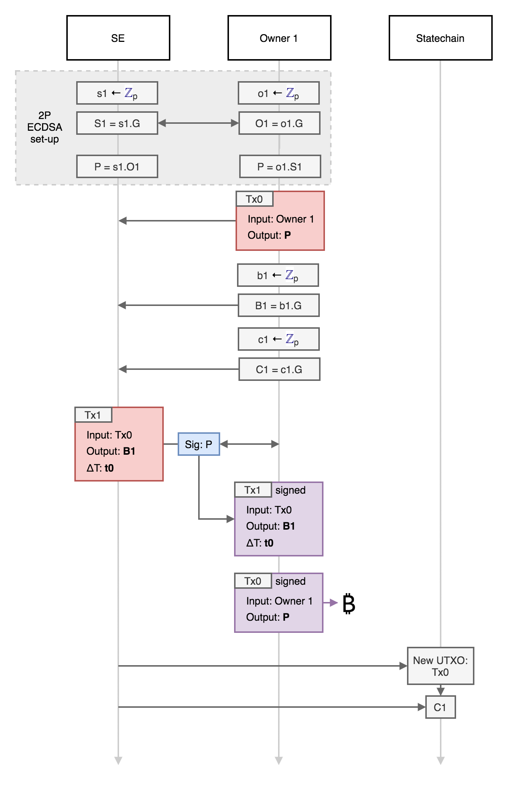
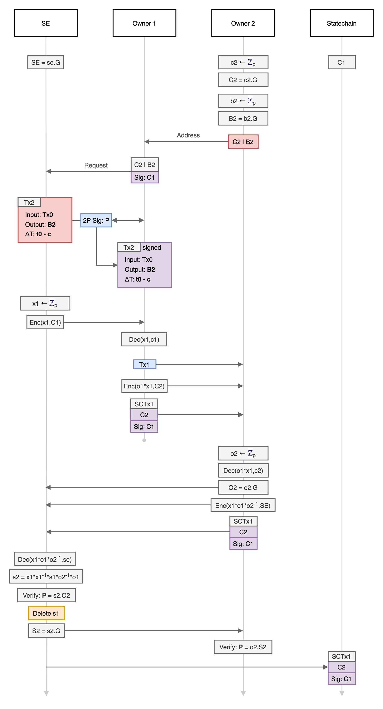

# Mercury Protocol

### Preliminaries

The SE and each owner are required to generate private keys securely and verify ownership of UTXOs (this can be achieved via a wallet interface, but formally should require connection to a fully verifying Bitcoin node). Elliptic curve points (public keys) are depicted as upper case letter, and private keys as lower case letters. Elliptic curve point multiplication (i.e. generation of public keys from private keys) is denoted using the `.` symbol. The generator point of the elliptic curve standard used (e.g. secp256k1) is denoted as `G`. All arithmetic operations on secret values (in Zp) are modulo the field the EC standard.  

Mercury employs the 2-of-2 MPC ECDSA protocol of Lindell as implementated in the ZenGo `gotham-city` 2-party wallet. The 2-of-2 ECDSA implementation used has two parties (with private keys `a` and `b`) where the shared public key is `P = ab.G` and both parties cooperate to create a signature for `P` without revealing either `a` or `b`.

In addition, a public key encryption scheme is required for blinded private key information sent between parties. This should be compatible with the EC keys used for signatures, and ECIES is used. The notation for the use of ECIES operations is as follows: `Enc(m,K)` denotes the encryption of message `m` with public key `K = k.G` and `Dec(m,k)` denotes the decryption of message `m` using private key `k`.

All transactions are created and signed using segregated witness, which enables input transaction IDs to be determined before signing and prevents their malleability. The SE specifies and publishes a Mainstay slot ID (`slot_id`) for the root of the SMT, which all UTXO statechains can be verified against.

### Deposit

An owner wants to deposit an amount of BTC into the platform, and they request that the `SE` cooperate with the initialisation and key generation. To prevent DoS attacks on an anonymous service, the `SE` may require that the depositor provide proof of ownership (i.e. signatures) for the funds they wish to deposit before proceeding. The following steps are then completed:

1. The depositor (Owner 1) generates a private key: `o1` (the UTXO private key share).
2. Owner 1 then calculates the corresponding public key of the share `O1` and sends it to the SE: `O1 = o1.G`
3. The SE then generates a private key: `s1` (the SE private key share), calculates the corresponding public key and sends it to Owner 1: `S1 = s1.G`
4. Both SE and Owner 1 then multiply the public keys they receive by their own private key shares to obtain the same shared public key `P` (which corresponds to a shared private key of `p = o1*s1`): `P = o1.(s1.G) = s1.(o1.G)`

> The above key sharing scheme is the same as that used in the 2P ECDSA protocols [4,5]. The key generation routines of these existing 2P ECDSA implementations can be used in place of the above steps (which include additional verification and proof steps).

5. Owner 1 generates `b1` (the backup private key) and computes `B1 = b1.G`.
6. Owner 1 generates `c1` (the proof private key) and computes `C1 = c1.G`.
7. Owner 1 creates a funding transaction (`Tx0`) to pay an amount `A` to the address corresponding to `P` (but doesn't sign it) [this transaction may also have an output for a fee `F` paid to the SE]. This defines the UTXO `TxID` (the outpoint), which is sent to the SE.
8. Owner 1 creates a *backup transaction* (`Tx1`) that pays the `P` output of `Tx0` to `B1`, and sets the `nLocktime` to the initial future block height `h0` (where `h0 = cheight + hinit`, `cheight` is the current Bitcoin block height and `hinit` is the specified initial locktime).
9. SE receives `Tx1` and `C1` from Owner 1 and verifies the `nLocktime` field. Owner 1 and the SE then sign `Tx1` with shared key (`P`) via 2P ECDSA, which Owner 1 then saves.
10. Owner 1 then signs and broadcasts their deposit transaction `Tx0`. Once the transaction is confirmed, the deposit is completed.
11. The SE then adds the public key `C1` to leaf of the SMT at position TxID of `Tx0`. The root of the SMT is then attested to Bitcoin via the Mainstay protocol in slot `slot_id`.

  

  Deposit protocol.

  

This deposit protocol is designed so that no funds are lost if either party becomes uncooperative at any stage. The deposit is only paid to the shared public key once the backup transaction is signed.

### Transfer

Owner 1 wishes to transfer the value of the deposit `A` to a new owner (Owner 2) (as a payment or as part of a complex trade). For this to proceed, the new owner must be aware of the public key that is used to authenticate the SE (`SE`). The new owner may require the current owner prove their unique ownership by signing a message with their key share (`O1`) as published on the statechain. The protocol then proceeds as follows:

1. The receiver (Owner 2) generates a backup private key `b2` and a statechain (proof) private key `c2` (separate keys are used for privacy). They then compute the corresponding public keys `B2 = b2.G` and `C2 = c2.G`.
2. `B2|C2` then represents the Owner 2 'address' and is communicated to Owner 1 (or published) in order for them to 'send' the ownership.
3. Owner 1 then requests that the SE facilitate a transfer to Owner 2 (and that the new owner can be authenticated with `C2`).
4. SE generates a random key `x1` and encrypts it with the Owner 1 statechain public key: `Enc(x1,C1)`
5. `Enc(x1,C1)` is sent to Owner 1 who decrypts it with `c1` to learn `x1`: `Dec(x1,c1)`
6. Owner 1 then computes `o1*x1` and encrypts it with the Owner 2 statechain public key (from the address): `Enc(o1*x1,C2)`
7. Owner 1 creates a new *backup transaction* (`Tx2`) that pays the `P` output of `Tx0` to `B2`, and sets the `nLocktime` to the relative locktime `h0 - (n-1)*c` where `c` is the confirmation interval and `n` is the owner number (i.e. 2).
8. The SE receives `Tx2` and verifies the `nLocktime` field corresponds to `h0 - (n-1)*c`. Owner 1 and the SE then sign `Tx2` with shared key (`P`) via 2P ECDSA, which Owner 1 then saves.

> The steps 3-8 only require interaction between the SE and owner 1, and can be performed at any time before the involvement of Owner 2 is required.

9. Owner 1 retrieves the UTXO statechain (ownership sequence) for `Tx0` and signs ownership to `C2` with private key `c1`: this is `SCTx1`
10. Owner 1 then sends Owner 2 a message containing four objects:
	a. `Tx2`
	b. `SCTx1`
	c. `Enc(o1*x1,C2)`

> At this point the Owner 1 has sent all the information required to complete the transfer to Owner 2 and is no longer involved in the protocol. Owner 2 verifies the correctness and validity of the four objects, and the payment is complete. Owner 1 can then complete the key update with the SE at any time.

The SE key share update then proceeds as follows:

11. Owner 2 generates a new output private key share `o2` and computes `O2 = o2.G`
12. Owner 2 decrypts object d: `Dec(o1*x1,c2)` and then computes `o1*x1*o2_inv` where `o2_inv` is the modular inverse of the private key `o2`.
13. Owner 2 then encrypts `Enc(o1*x1*o2_inv,SE)`, signs it with `C2` and sends it to the SE along with `SCTx1` and `O2`.
14. The SE authenticates and decrypts this to learn `o1*x1*o2_inv`: `Dec(o1*x1*o2_inv,se)`
15. The SE then multiplies this product by `x1_inv*s1` (where `x1_inv` the modular inverse of `x1`) to compute `s2 = o1*o2_inv*s1`.
16. The SE then verifies that `s2.O2 = P` and deletes the key share `s1`. If the SE operations are run in a secure enclave, a remote attestation of this can be sent to Owner 2.

> `s2` and `o2` are now key the private key shares of `P = s2*o2.G` which remains unchanged (i.e. `s2*o2 = s1*o1`), without anyone having learnt the full private key. Provided the SE deletes `s1`, then there is no way anyone but the current owner (with `o2`) can spend the output.

17. The SE sends Owner 2 `S2 = s2.G` who verifies that `o2.S2 = P`
18. The SE then adds the public key `C1` to the leaf of the SMT at position TxID of `Tx0`. The root of the SMT is then attested to Bitcoin via the Mainstay protocol in slot `slot_id`.

  

  Ownership transfer protocol.

  

> The SE keeps a database of backup transactions for the users, and broadcast them at the appropriate time in case the users are off-line.

### Orderly Withdrawal

The current owner of a deposit can at any time withdraw from the platform to either gain complete control of the shared key or broadcast a jointly signed transaction. The current owner can request that the SE cooperates in signing a transaction paying the UTXO to certain addresses specified by the owner. The SE may wish to charge a withdrawal fee for providing the service (`F`), which can be included in this transaction.

This would proceed as follows:

1. The current owner (e.g. Owner 2) creates a transaction `TxW` that spends `Tx0` to an address `W`.
2. The owner then requests that the SE cooperate to sign this transaction using the shared public key `P`.
3. The owner signs the current state concatenated with `H(W)` with their key `C2` and sends it to the SE.
4. SE and the owner sign `TxW`. The SE must confirm that `TxW` pays to `W` (otherwise this will create a fraud proof).
3. The fully signed `TxW` is then broadcast and confirmed.
4. The SE commits the close string to the leaf of the SMT at position TxID of `Tx0`, to verifiably close the UTXO chain of ownership.

### Backup withdrawal

In the case that the SE disappears or does not cooperate with the current owner, the current owner can reclaim their funds to an address they control by submitting the kick-off transaction, and then after a timelock delay, their backup transaction. In order to get the kick-off transaction to confirm, they will have to simultaneously submit and CPFP transaction spending the `OP_TRUE` output of `TxK`.

This would proceed as follows:

1. The current owner creates a fee paying transaction `TxF` has as the `OP_TRUE` output of `TxK` as an input, and other signed inputs sufficient to pay the miner fees for both `TxF` and `TxK`. The output can be to any address chosen by the owner.
2. The current owner broadcasts both `TxK` and `TxF`, which are then confirmed in the Bitcoin blockchain.
3. Once `TxK` is confirmed, the current owner broadcasts their backup transaction (e.g. `Tx2`) after the `nSequence` timelock has expired.

> The owner must ensure they broadcast the backup transaction immediately after the timelock to prevent previous owners from claiming after longer timeouts.