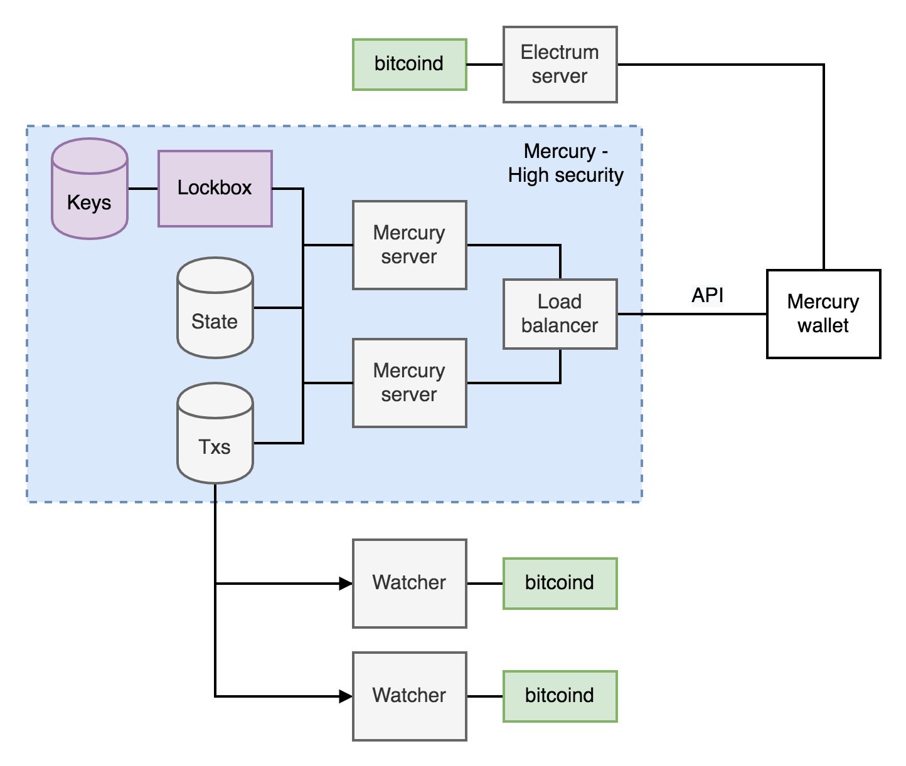

# Mercury Architecture

## Mercury server archecture

The lockbox is a separate application to the main Mercury server that performs all server private key share generation and operations, and stores the server private key shares in a secured way (sealed). The main server application handles all communication with user wallets, all the statechain (proof and commitment) operations and backup system (watching). The main server (which can be replicated) calls the Lockbox server whenever a private key share operation is required: these operations are:

1. Server key share generation, verification and pubkey derivation upon user deposit (`master_key`, `first_message`, `second_message`). 
2. Backup transaction co-signing on both deposit and transfer (`sign_first` and `sign_second`). 
3. Key share transfer, update and deletion. (generation of `x1` in `transfer_init` and `s2` share update and deletion in `transfer_receiver`). 

To provide additional protections against malicious access to the unprotected server and physical access to the lockbox machine - the lockbox enclave can also perform verification of the any transaction signed, to ensure that `nLocktime` is decremented correctly (storing the latest `nLocktime` state for each key share). The transaction pre-image and sighash would be deserialised within the enclave and verified. 

  

  Schematic of the Mercury statechain infrastructure. 

  
