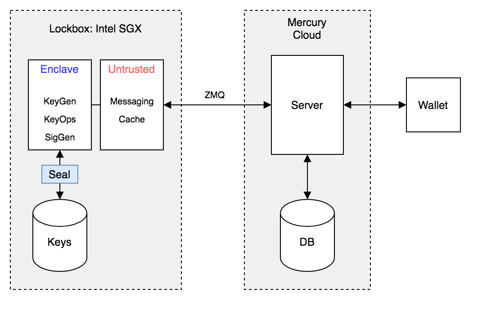

# Lockbox specification and API

The management of Mercury server secret key shares is secured using Intel SGX secure enclaves (trusted execution environments). 

The motivation for this design is to ensure two crucial properties: 

1. That the server key share is secured, even from an attacker that has root access to the server or physical access to the hardware. 
2. The server key shares are securely deleted (or become unrecoverable) when they expire (i.e. the ownership of a state coin moves to a new user. 

Intel SGX enclaves can achieve both of these properties by generating, updating and using the statecoin server key shares exclusively within secure enclaves. In this case, the server key shares can never leave an enclave and only be updated and used in two-party signing operations when authenticated with a statecoin owner public key - even the system admin and developers with root access would be unable to either extract a key or perform an unauthenticated two-party signing operation. 

### SGX Application Architecture considerations

The use of a secure SGX enclave limits execution of enclave code to a single, specific Intel CPU. An enclave cannot be replicated on several machines, and is confined to the CPU it was created on (however, enclaves can share secrets with other enclaves on different machines if that is what it is programmed to do). 

Therefore, the enclave-specific operations should be separated (onto a specific Intel CPU machine) from the main server operations, which are continuously serving the public API and can be dynamically replicated depending on demand/load. 

All of the server key share operations will then take place in the separate bare-metal machine, which communicates with the main server. 

The server private key share operations will be performed by a separate daemon which will run two separate threads using SGX instructions and functions: an untrusted thread that has full system access and can send and receive messages with the main server, and a trusted thread (the enclave) which is inaccessible to the rest of the system and can only be interacted with via function calls from the untrusted thread (`Ecalls`). 

The state of the trusted thread (enclave) can be stored persistently on disk via the SGX sealing process (i.e. secrets are encrypted with enclave keys) to handle both large numbers of key shares and system shut downs. 

<br><br>
<p align="center">

</p>

<p align="center">
  Schematic of the Lockbox set-up and connections. 
</p>
<br><br>


Summary of changes to server secrets:

```
	s2 generated in enclave
	paillierkeypair generated in enclave (removed from Table::Ecdsa)
	paillierkeypair generated in enclave (removed from Table::Ecdsa)
	party1private generated in enclave (removed from Table::Ecdsa)
	epheckeypair generated in enclave (removed from Table::Ecdsa)
```

The enclave secrets will be sealed and stored on the SGX enabled machine after each operation. 

Lockbox server will be called to perform operations in:

```
	first_message
	second_message
    sign_first
    sign_second
	transfer_receiver
	transfer_finalize [[with attestation of key share deletion]]
```

### Lockbox-server communication

Required high performance and a request-reply and push-pull pattern supporting multi-threading and message queuing. 

The main server will request the Lockbox server to perform specified operations as they are required according to, in turn, by operations requested by user wallets via the public API. 

### Attestation

Attestation is the process of proving that a specified program has been run on a specific machine. For Intel SGX, this is a mechanism that can be used to prove to third parties that specific cryptographic operations have been performed in a specified way within an enclave. For the Mercury protocol, this process can be used to prove to a user/public that two party key shares have been generated within the enclave in a specified way, and old shares deleted when updated in a way that they cannot be recovered. This attestation can be verified by users. 

## Lockbox API specification

The main Mercury server application makes HTTP POST requests to the Lockbox application to perform *statechain entity* private key share operations, including key generation, ZK proof generation, message signing and key share update and deletion. A description of the Server-Lockbox API is described below:

### REST framework structure

```
response = json response object

response['error'] : json response error field
```

### Key generation

#### First message

Keygen first message

**request:** https://0.0.0.0/ecdsa/keygen/first

*data*
```
KeyGenMsg1 {
    shared_key_id: Uuid,
    protocol: Protocol,
}
```

*response*
```
KeyGenFirstMsg {
    pk_commitment: BigInt,
    zk_pok_commitment: BigInt,
}
```

#### Second message

Keygen second message

**request:** https://0.0.0.0/ecdsa/keygen/second

*data*
```
KeyGenMsg2 {
    shared_key_id: Uuid,
    dlog_proof: DLogProof,
}
```

*response*
```
KeyGenParty1Message2 {
    ecdh_second_message: party_one::KeyGenSecondMsg,
    ek: EncryptionKey,
    c_key: BigInt,
    correct_key_proof: NICorrectKeyProof,
    pdl_statement: PDLwSlackStatement,
    pdl_proof: PDLwSlackProof,
    composite_dlog_proof: CompositeDLogProof,
}
```

### Signing

#### Sign first

First signing message to generate shared ephemeral signing key and proof. 

**request:** https://0.0.0.0/ecdsa/sign/first

*data*
```
SignMsg1 {
    shared_key_id: Uuid,
    eph_key_gen_first_message_party_two: party_two::EphKeyGenFirstMsg,
}
```

*response*
```
EphKeyGenFirstMsg {
    d_log_proof: ECDDHProof,
    public_share: GE,
    c: GE,
}
```

#### Sign second

Second signing message to generate signature

**request:** https://0.0.0.0/ecdsa/sign/second

*data*
```
SignMsg2 {
    shared_key_id: Uuid,
    sign_second_msg_request: SignSecondMsgRequest,
}
```

*response*
```
Vec<Vec<u8>>
```

### Transfer structs

#### Keyupdate first

**request:** https://0.0.0.0/ecdsa/keyupdate/first

*data*
```
KUSendMsg {
    user_id: Uuid,
    statechain_id: Uuid,
    x1: FE,
    t1: FE,
    o2_pub: GE,
}
```

*response*
```
pub struct KUReceiveMsg {
    theta: FE,
    s2_pub: GE,
}
```

#### Keyupdate second

**request:** https://0.0.0.0/ecdsa/keyupdate/second

*data*
```
KUFinalize { 
    statechain_id: Uuid,
    shared_key_id: Uuid,
}
```

*response*
```
KUAttest {
    statechain_id: Uuid,
    attestation: String,
}
```

### Function descriptions

``
fn keyupdate_first(&self, reciever_msg: KUSendMsg) -> Result<KUReceiveMsg>
``

The lockbox receives `user_id`, `statechain_id`, the (server generated) transfer nonce `x1`, transfer product `t2` and new owner public key share `o2_pub` from the server (in struct `KUSendMsg`). 

Then the following operations are performed:

```
    let s1 = self.database.get_private_keyshare(reciever_msg.user_id)?;

    let x1 = reciever_msg.x1;
    let t2 = reciever_msg.t2;

    // derive updated private key share
    s2 = t2 * (td.x1.invert()) * s1;

    theta = FE::new_random();
    // Note:
    //  s2 = o1*o2_inv*s1
    //  t2 = o1*x1*o2_inv
    let s1_theta = s1 * theta;
    let s2_theta = s2 * theta;

    let g: GE = ECPoint::generator();
    s2_pub = g * s2;

    let p1_pub = kp.party_2_public * s1_theta;
    let p2_pub = reciever_msg.o2_pub * s2_theta;

    // Check P1 = o1_pub*s1 === p2 = o2_pub*s2
    if p1_pub != p2_pub {
        error!("TRANSFER: Protocol failed. P1 != P2.");
        return Err(SEError::Generic(String::from(
            "Transfer protocol error: P1 != P2",
        )));
    }
```

The lockbox then saves `s2` in a local sealed database (references with `user_id`). The `ecdsa_keypair` for this user is not deleted yet (it will be at finalisation/keyupdate_second). 

The struct `KUReceiveMsg { theta, s2_pub }` is then returned to the server. 

```
fn keyupdate_second(&self, finalize_data: KUFinalize) -> Result<KUAttest>;
```

This function is called when the transfer is finalised. If `keyupdate_first` is run again (e.g. in case of failed batch), the same initial `s1` is used again to derive `s2` again. 

Once `keyupdate_second` is called, the initial `s1` must be deleted. The previously saved `s2` is then used as the active private keyshare (which will be used as `s1` in the next `keyupdate_first` for this utxo). 
