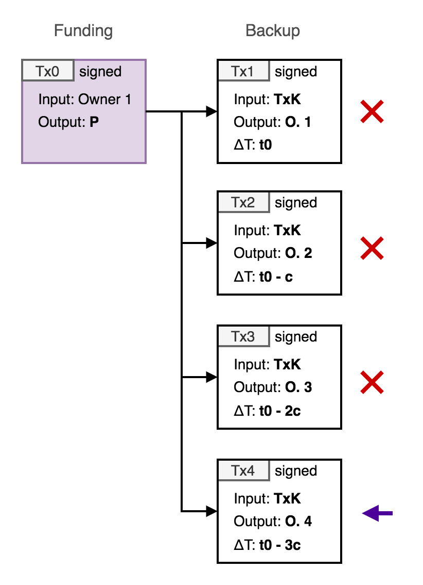
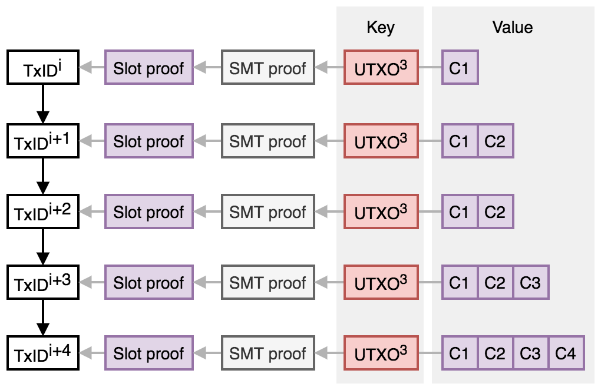

# Introduction

Mercury is an implementation of a layer-2 statechain protocol that enables off-chain transfer and settlement of Bitcoin outputs that remain under the full custody of the owner at all times, while benefiting from instant and neglible cost transactions. The ability to perform this transfer without requiring the confirmation (mining) of on-chain transactions has advantages in a variety of different applications. 

This documentation covers the description of the Mercury architecture and protocol, the specification Mercury API and instructions for the deployment and operation of the separate components of the system. 

## Overview

A *unspent transaction outputs* (UTXO) is the fundamental object that defines value and ownership in a cryptocurrency such as Bitcoin. A UTXO is identified by a transaction ID (`TxID`) and output index number (`n`) and has two properties: 1. A value (in BTC) and 2. Spending conditions (defined in Script). The spending conditions can be arbitrarily complex (within the limits of the consensus rules), but is most commonly defined by a single public key (or public key hash) and can only be spent by transaction signed with the corresponding public key. This is known as a pay-to-public-key-hash output (P2(W)PKH). 

The simplest function of the Mercury system is to enable the transfer the ownership of individual UTXOs controlled by a single public key `P` from one party to another without an on-chain (Bitcoin) transaction (or change in the spending condition). The SE facilitates this change of ownership, but has no way to seize, confiscate or freeze the output. To enable this, the private key (`s`) for `P` (where `P = s.G`) is shared between the SE and the owner, such that neither party ever has knowledge of the full private key (which is `s = s1*o1` where `s1` is the SE private key share, and `o1` is the owner key share) and so cooperation of the owner and SE is required to spend the UTXO. However, by sharing the secret key in this way, the SE can change its key share (`s1 -> s2`) so that it combines with a new owner key share (`o2`) with the cooperation of the original owner, but without changing the full key (i.e. `s1*o1 = s2*o2`) all without any party revealing their key shares or learning the full key. The exclusive control of the UTXO then passes to the new owner without an on-chain transaction, and the SE only needs to be trusted to follow the protocol and delete/overwrite the key share corresponding to the previous owner.

This key update/transfer mechanism is additionally combined with a system of *backup* transactions which can be used to claim the value of the UTXO by the current owner in the case the SE does not cooperate or has disappeared. The backup transaction is cooperatively signed by the current owner and the SE at the point of transfer, paying to an address controlled by the new owner. To prevent a previous owner (i.e. not the current owner) from broadcasting their backup transaction and stealing the deposit, the `nLocktime` value of the transaction is set to a future specified block height. Each time the ownership of the UTXO is transferred, the `nLocktime` is decremented by a specified value, therefore enabling the current owner to claim the deposit before any of the previous owners.

  

  Schematic of confirmed funding transaction, and off-chain signed backup transactions with decrementing nLocktime for a sequence of 4 owners.

  

The decrementing timelock backup mechanism limits the number of transfers that can be made within a reasonable lock-out time, and will be specified and enforced by the SE. In order to ensure that the valid backup transaction is broadcast to the Bitcoin network at the correct time, and prevent expired owners from attempting to steal funds, the SE operates multiple *watch* servers that monitor the block height and broadcast user backup transactions when required. If the SE is shut down then the user is responsible for submitting backup transactions to the Bitcoin network at the correct time, and applications are available to do this automatically.

The life-cycle of a P2PKH deposit into the statechain, transfer and withdrawal is summarised as follows:

1. The depositor (Owner 1) initiates a UTXO statechain with the SE by paying BTC to a P2PKH address where Owner 1 and the SE share the private key required to spend the UTXO. Additionally, the SE and the depositor can cooperate to sign a backup transaction spending the UTXO to a relative timelocked transaction spending to an address controlled by Owner 1 which can be confirmed after the `nLocktime` block height in case the SE stops cooperating.
3. Owner 1 can verifiably transfer ownership of the UTXO to a new party (Owner 2) via a key update procedure that overwrites the private key share of SE that invalidates the Owner 1 private key and *activates* the Owner 2 private key share. Additionally, the transfer can incorporate the cooperative signing of a new backup transaction paying to an address controlled by Owner 2 which can be confirmed after an `nLocktime` block height, which is shortened (by an accepted confirmation interval) from the previous owners backup transaction `nLocktime`.
5. This transfer can be repeated multiple times to new owners as required (up until the most recent recovery `nLocktime` reaches a lower limit determined by the current Bitcoin block height).
6. At any time the most recent owner and SE can cooperate to sign a transaction spending the UTXO to an address of the most recent owner's choice (i.e. withdrawal). 

Double-spending of the UTXO (by a corrupt SE) is prevented by a proof-of-uniqueness from the Mainstay protocol. Each unique transfer of the UTXO between owners is recorded on the SE statechain, with each transfer requiring a signature from the current owner. Spending of the UTXO by anyone except the current owner can be unambiguously proven as fraudulent by the current owner.

##  Statechains

The essential function of the Mercury system is that it enables 'ownership' (and control) of a UTXO to be transferred between two parties (who don't need to trust each other) via the SE without an on-chain transaction. The SE only needs to be trusted to operate the protocol (and crucially not store any information about previous key shares) and then the transfer of ownership is completely secure, even if the SE was to later get compromised or hacked. At any time the SE can prove that they have the key share for the current owner (and only to the current owner). Additional trust would be required in the SE that they are not double-spending the output, however they would need to collude with a current owner in order to attempt to do this. However a new owner (i.e. the buyer of the UTXO) requires a guarantee that this hasn't happened (i.e. that the current owner and SE have conspired to pass ownership to two or more buyers). To guarantee this, the new owner requires a proof that their ownership is *unique*: this is achieved via UTXO *statechains* - immutable and unique sequences of verifiable ownership transfer. The current owner is required to sign a *statechain transaction* (`SCTx`) with an owner key to transfer ownership to a new owner (i.e. a new owner key). This means that any theft of the UTXO by the collusion of a corrupt SE and old owner can be independently and conclusively proven.

The *ownership proof* then consists of a unique sequence of ownership keys (with signed transfers) for the full history of each UTXO. This full history is published by the SE, using the Mainstay protocol to ensure this sequence is both unique and immutable. This utilises Bitcoin's global state (resulting in a verifiable *proof of publication* for each ownership change).

### Sparse Merkle Tree

A specific SE will operate the proof of publication for all UTXO ownership sequences under its management via a single Mainstay slot (for details refer to the Mainstay [documentation](https://commerceblock.readthedocs.io/en/latest/mainstay-con/index.html)). The SE will commit the root of a [*sparse Merkle tree*](https://eprint.iacr.org/2016/683.pdf) (SMT) into the specified slot every time it is updated (which then in turn is attested to the Bitcoin staychain every block/hour). The SMT has a leaf for each unique UTXO TxID (256 bit number) managed by the SE, and the current UTXO statechain is committed to this leaf at each update. The use of the SMT enables proof that each leaf commitment is unique to the UTXO TxID.

  

  Illustration of sequences of UTXO ownership (statechains) committed to the sparse Merkle tree (SMT), the root of which is in turn committed to a defined Mainstay slot (slot_id), which is in turn committed to the staychain of transactions on the Bitcoin blockchain.

  

### Ownership transfer

The UTXO ownership sequence consists of a chain of *statechain transactions* (`SCTx`) transferring ownership. This chain starts with the single *proof* public key of the depositor, and each time the ownership of the UTXO is passed from one owner to the next, the current owner must sign the statechain concatenated with the new owner proof public key. Specifically, when a user deposits into a new UTXO with the SE, they provide a proof public key `C1` (to which only the depositor knows the private key `c1`). This initial state (`s_1 = H(C1)` where `H(...)` denotes the SHA256 hash function) is committed to the SE SMT at the position of the UTXO TxID.

When the depositor (`C1`) then transfers ownership to `C2` they provide a signature `sig_C1` over `s_1|C2` and the new state:

`s_2 = H(s_1|C2|sig_C1[s_1|C2])`

which is then committed to the SMT at the position of the UTXO TxID. Then when the owner `C2` transfers ownership to `C3` they provide a signature `sig_C2` over `s_2|C3`. The new state then becomes:

`s_3 = H(s_2|C3|sig_C2[s_2|C3])`

and so on for each transfer of ownership from `old_key` to `new_key`:

`new_state = H(old_state|new_key|sig_old_key[old_state|new_key])`

If no change of ownership occurs between Mainstay attestations, the state does not change (and the latest slot attestation is the proof of publication). If the ownership changes more frequently than the slot attestation, then the ownership state is updated for each transfer and the current state is attested at the next interval.

  

  Merkle path proofs of UTXO state publication. The committed state for a specified UTXO TxID is updated as the ownership is transferred between public keys.

  

### Fraud Proof

The statechain (and its proof of publication in the Bitcoin staychain) for a specific UTXO can be used by the current owner as proof of ownership and as a fraud proof if the UTXO is spent without their permission (i.e. by a corrupt or colluding SE keeping old key shares). This acts as a powerful incentive to keep the SE honest and preventing them from committing a large scale fraud. In order to spend the UTXO, the current owner must sign a `SCTx` transaction with their proof public key (`C`) to the address the Bitcoin UTXO is paid to - if this address is different, this is proof that the SE is corrupt.

The proof-of-publication (via Mainstay) acts as a proof of unique ownership of the UTXO by the owner, however this has a latency that is limited by the Mainstay attestation period (i.e. the Bitcoin block confirmation time). Proof of ownership cannot be obtained faster than this, however a proof of fraud can be. The state can be committed to an unconfirmed Mainstay transaction instantly (and updated via the replace-by-fee mechanism) which must be signed by the Mainstay operator. 